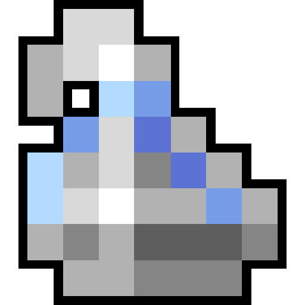

# ROTMG Whitebag & Shiny Checklist

<div align="center">



A modern, feature-rich checklist application for tracking **White Bag** and **Shiny** items in Realm of the Mad God.

[](https://moejde.github.io/ChecklistShinyROTMG/)
[](LICENSE)
[](https://developer.mozilla.org/en-US/docs/Web/HTML)
[](https://developer.mozilla.org/en-US/docs/Web/JavaScript)
[](https://developer.mozilla.org/en-US/docs/Web/CSS)

[Features](#features) • [Demo](https://moejde.github.io/ChecklistShinyROTMG/) • [Installation](#installation) • [Usage](#usage) • [Technologies](#technologies)

</div>

---

## 📋 Overview

ROTMG Whitebag & Shiny Checklist is a comprehensive web application designed to help Realm of the Mad God players track their collection of rare items. Built with vanilla JavaScript and optimized for performance, it offers an intuitive interface for managing your White Bag and Shiny item collections.

## ✨ Features

### 🎯 Core Functionality

- **Visual Item Gallery** - Browse all items with sprite-based graphics rendered from the game's asset files
- **Dual Category System** - Track both White Bag and Shiny items separately or together
- **Click-to-Track** - Simple click interface to mark items as collected
- **Real-time Progress** - Visual progress bars showing collection completion for each category
- **Auto-categorization** - Automatically categorizes items based on bag type and labels from game data

### 🔍 Advanced Filtering & Search

- **Smart Search** - Instant search by item name with accent-insensitive normalization
- **Category Filters** - Toggle between White Bag, Shiny, or both categories
- **Collection Status Filter** - View all items, only collected, or only uncollected
- **Tri-state Filtering** - Flexible filtering with "All", "Collected", and "Not Collected" modes

### 🎨 User Interface

- **Dark Theme** - Eye-friendly dark interface optimized for extended use
- **Responsive Grid** - Adjustable column count (scroll to change grid density)
- **Sorting Options** - Sort by Object ID or item name, ascending or descending
- **Visual Progress Bars** - Vertical progress indicators for White Bag and Shiny categories
- **RealmEye Integration** - Direct links to view items on RealmEye

### 💾 Data Management

- **Auto-save** - Progress automatically saved to browser's localStorage
- **Import/Export** - Export your progress as JSON and import on any device
- **File System Access API** - Optional persistent file storage for advanced users
- **Progress Persistence** - Never lose your tracking data

### 🌐 Internationalization

- **Multi-language Support** - English and Portuguese (BR) translations
- **Language Switcher** - Easy toggle between supported languages

### 🗑️ Item Management

- **Delete Mode** - Remove items from your checklist temporarily
- **Removed Items Library** - View and restore deleted items at any time
- **Click-to-Restore** - One-click restoration from the library

### 📊 Statistics

- **Total Items** - Track total number of items in your collection
- **Collection Progress** - See how many items you've collected
- **Category Breakdown** - Separate stats for Shiny and White Bag items
- **Matched Items** - View items successfully matched with game data

#demo

**[🎮 Try Live Demo](https://moejde.github.io/ChecklistShinyROTMG/)** — Hosted on GitHub Pages, automatically updated with every commit!

## 📦 Installation

### Prerequisites

- A modern web browser (Chrome, Firefox, Edge, Safari)
- Local web server (optional, for best experience)

### Quick Start

1. **Clone the repository**
   ```bash
   git clone https://github.com/Moejde/ChecklistShinyROTMG.git
   cd ChecklistShinyROTMG
   ```

2. **Serve the application**

   Using Python:
   ```bash
   python -m http.server 8000
   ```

   Or using Node.js:
   ```bash
   npx http-server
   ```

3. **Open in browser**
   ```
   http://localhost:8000/
   ```

### Alternative: Direct File Access

Simply open `index.html` directly in your browser. Note that some features (like File System Access API) may require a web server.

## 🎮 Usage

### Basic Usage

1. **Browse Items** - Scroll through the visual gallery of items
2. **Mark as Collected** - Click on any item to toggle its collected status
3. **Filter Your View** - Use the filter buttons to show specific categories
4. **Search Items** - Use the search bar to find specific items by name
5. **Track Progress** - Watch the progress bars update as you collect items

### Advanced Features

#### Adjusting Grid Columns
- Hover over the column indicator
- Scroll up/down to increase/decrease columns
- Your preference is automatically saved

#### Exporting Progress
1. Go to the **Settings** tab
2. Click **Export progress (.json)**
3. Save the file to your device

#### Importing Progress
1. Go to the **Settings** tab
2. Click **Import progress (.json)**
3. Select your previously exported file

#### Using Delete Mode
1. Enable **Delete Mode** toggle
2. Click the red X button on items you want to remove
3. View removed items in the **Removed Items Library**
4. Click any removed item to restore it

## 🏗️ Project Structure

```
ChecklistShinyROTMG/
├── index.html              # Main application file
├── i18n/                   # Internationalization files
│   ├── en.json            # English translations
│   └── pt-BR.json         # Portuguese (BR) translations
├── equip.txt              # Equipment data from game
├── items_meta.xml         # Item metadata
├── imgs/
│   ├── favicon.png        # Application icon
│   ├── WhiteBag.png       # White Bag category icon
│   ├── Shiny.png          # Shiny category icon
│   ├── spritesheet.json   # Spritesheet atlas data
│   └── mapObjects.png     # Item sprites atlas
└── tools/                 # Development utilities (not deployed)
    └── [Build and processing scripts]
```

## 🛠️ Technologies

### Core Technologies

- **HTML5** - Semantic markup and modern web standards
- **CSS3** - Custom properties, animations, and grid layouts
- **Vanilla JavaScript** - No frameworks, pure ES6+ JavaScript

### Web APIs Used

- **localStorage API** - Persistent progress storage in browser
- **File System Access API** - Optional file-based progress storage
- **Canvas API** - Sprite rendering and image manipulation
- **Fetch API** - Loading game data and translations
- **IndexedDB** - Persistent storage for file handles

### Key Features

- **Responsive Design** - Adapts to all screen sizes
- **Performance Optimized** - DOM caching, memoization, debouncing
- **Accessible** - Keyboard navigation and screen reader support
- **Progressive Enhancement** - Works without advanced APIs

## 🎨 Visual Features

### Progress Tracking
- Vertical progress bars for each category
- Rainbow gradient for Shiny items
- Visual percentage indicators
- Real-time updates on collection changes

## 📝 Data Sources

The application loads data from several sources:

- **equip.txt** - Equipment definitions from game files
- **items_meta.xml** - Additional item metadata and categorization
- **spritesheet.json** - Sprite atlas mapping for item images
- **all_portals.txt** - Portal and dungeon information

## 🔧 Development Tools

The `tools/` directory contains utilities for:
- Asset extraction from Unity builds
- Sprite sheet processing
- Data categorization and filtering
- Build automation

*Note: These are development tools and not required for using the application.*

## 🤝 Contributing

Contributions are welcome! Please feel free to submit a Pull Request.

## 📄 License

This project is licensed under the MIT License - see the [LICENSE](LICENSE) file for details.

## 🙏 Acknowledgments

- **Realm of the Mad God** - Game assets and data
- **DECA Games** - Current game developers
- **RealmEye** - Community database integration
- **Community Contributors** - Item data and testing

## 📞 Support

If you encounter any issues or have questions:
- Open an issue on GitHub
- Check existing issues for solutions
- Review the documentation

---

<div align="center">

Made with ❤️ for the ROTMG community

**[⬆ Back to Top](#rotmg-whitebag--shiny-checklist)**

</div>
